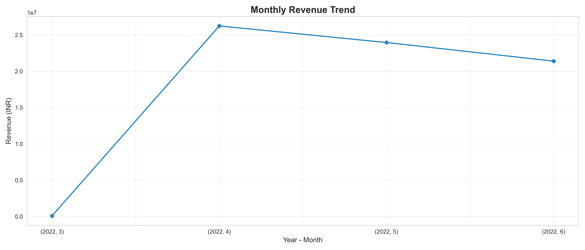
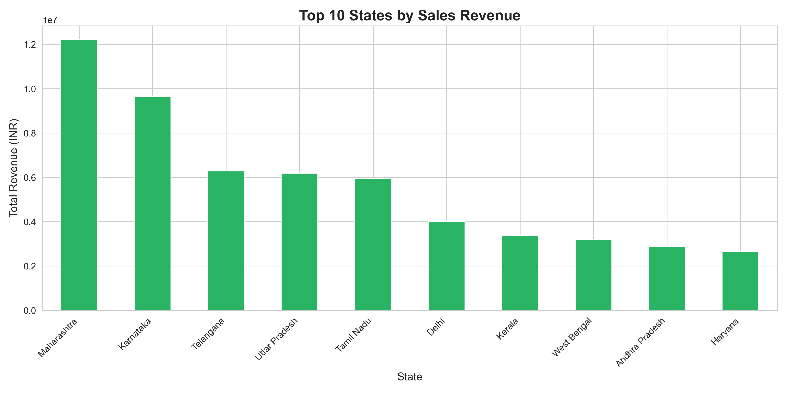
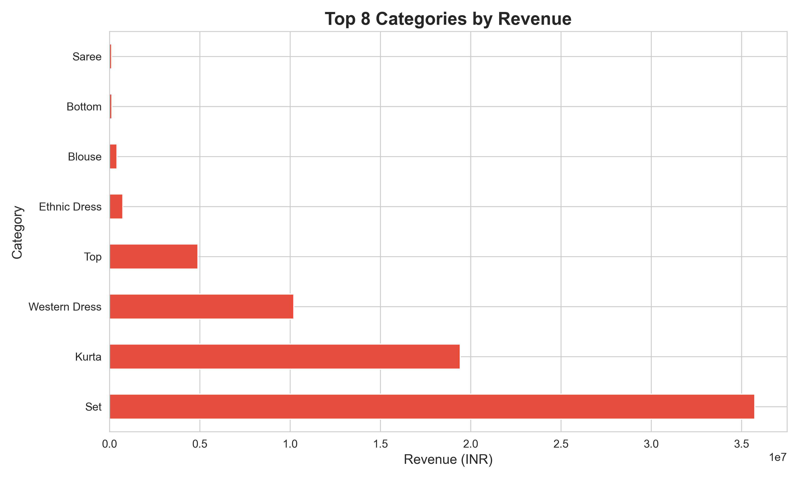
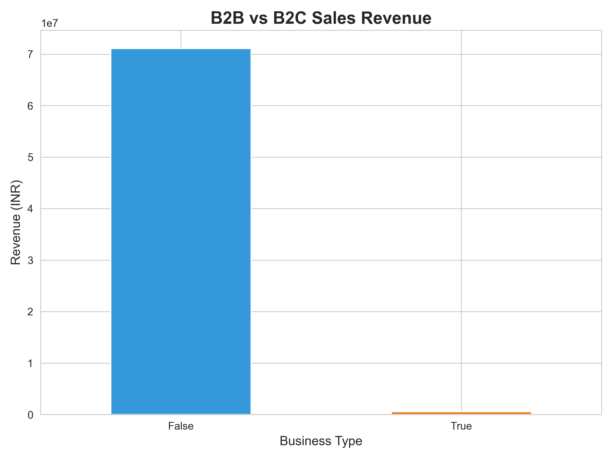
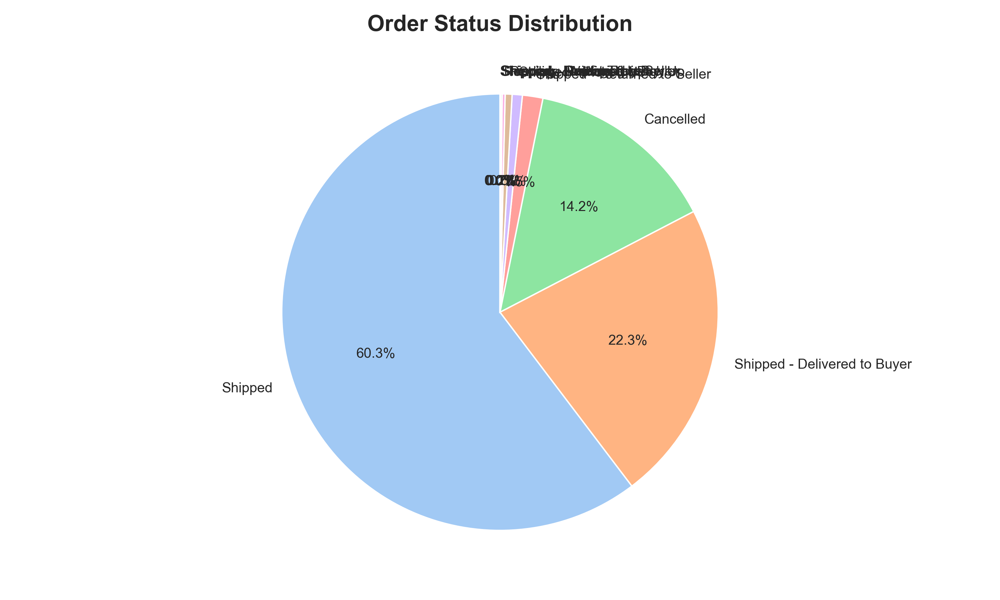
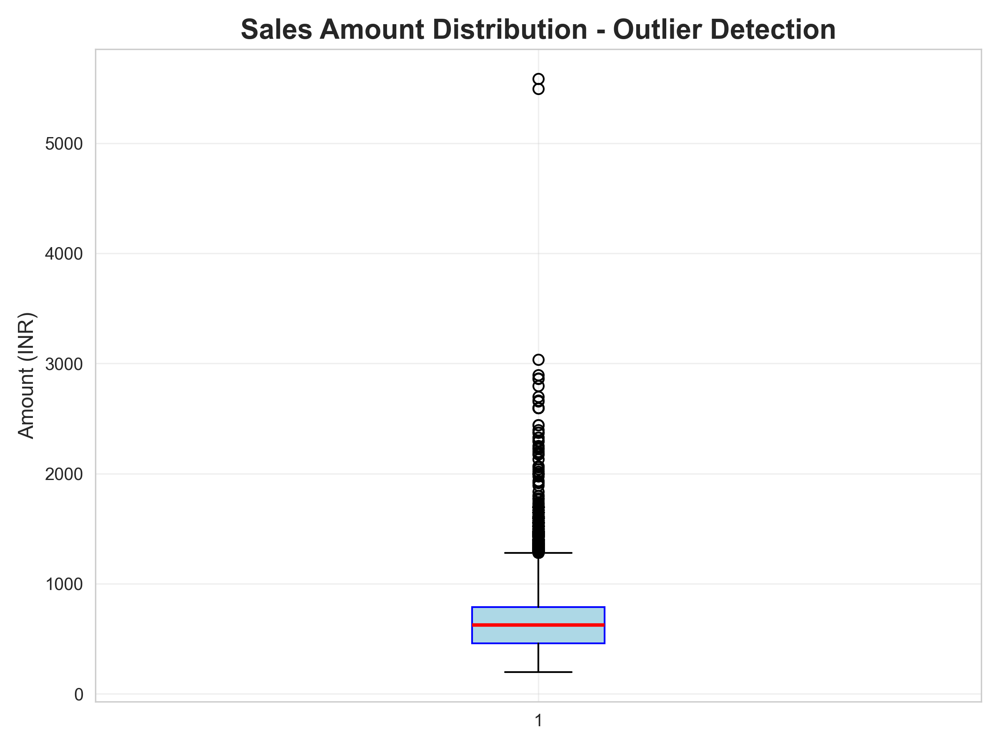

# 🛒 Amazon Sale Report Data Cleaning & Exploratory Analysis

This project performs **data cleaning, KPI computation, and exploratory analysis** on a real-world **Amazon Retail Sales dataset**.  
It also includes an **Object-Oriented Python class (SalesAnalyzer)** encapsulating all analytics logic.

---

## 📂 Project Structure
```
📁 Project/
├── Amazon Sale Report.csv
├── Cleaned_Amazon_Sale_Report.csv
├── EDA.ipynb
├── Kpi Analysis.ipynb
├── SalesAnalyzer.py
├── amazon.ipynb
├── streamlit_app.py (Streamlit Dashboard)
├── outlier_boxplot.png
│──monthly_revenue_trend.png
│── category_sales.png
│── top_states_sales.png
│── order_status_distribution.png
│── b2b_vs_b2c.png
│
└── README.md
```

---

## 🎯 Project Goals

- Clean raw retail sales data (missing values, duplicates, formatting issues)
- Perform type conversion (dates, numeric fields, booleans, categories)
- Compute key business KPIs:
  - Monthly Revenue  
  - Region-wise Sales  
  - Profit Margin (%)  
  - Average Order Value (AOV)  
  - Cancellation Rate  
  - Category-wise Sales  
  - B2B vs B2C Sales Split  
- Visualize insights using **Matplotlib** and **Plotly**
- Implement an **OOP-based SalesAnalyzer class** to automate analysis
- Interactive **Streamlit Dashboard** for real-time exploration

---

## 🧹 1. Data Cleaning Summary

Key cleaning operations performed:

### ✔ Column Normalization
- Trimmed column name spaces  
- Dropped `index` and `Unnamed:22`

### ✔ Datatype Fixes
- `Date` → datetime  
- `Amount` & `Qty` → numeric  
- `ship-postal-code` → string  
- `B2B` → boolean

### ✔ Text Standardization
- Title case for cities/states  
- Uppercase for sizes  
- Cleaned category names

### ✔ Intelligent Missing Value Handling
- Courier Status → `"Pending"`  
- Promotion IDs → `"No Promotion"`  
- Currency → `"INR"`  
- Fulfilled-by assigned using **Fulfilment logic**

### ✔ Special Logic
Cancelled orders are assigned `Amount = 0`.

### ✔ Final Output
Cleaned dataset saved as: `Cleaned_Amazon_Sale_Report.csv`

---

## 📊 2. KPI Analysis

All KPI logic is implemented in **SalesAnalyzer.py** using OOP.

### 📈 Monthly Revenue Trend


### 🗺 Region-wise Sales (Top States)


### 🏷 Category-wise Sales Distribution


### 👥 B2B vs B2C Comparison


### 📦 Order Status Distribution


### ⚠️ Outlier Detection (Sale Amount)


---

## 🧮 3. Additional KPIs Computed

- **Profit Margin %**: Assuming baseline cost = 65% of selling price
- **Average Order Value (AOV)**: `Total Revenue / Number of Orders`
- **Cancellation Rate**: Percentage of orders marked Cancelled
- **Top Performing Categories**: By revenue and quantity
- **Fulfilment Performance**: Amazon vs Merchant comparison

---

## 🧠 4. SalesAnalyzer OOP Class

The project includes a full OOP implementation in `SalesAnalyzer.py`

### Features
- Monthly Revenue Analysis
- Region Sales Breakdown
- Average Order Value Calculation
- Profit Margin Computation
- Cancellation Rate Analysis
- Automated Trend Charts
- Outlier Detection Visualizations

### Example Usage
```python
from SalesAnalyzer import SalesAnalyzer
import pandas as pd

df = pd.read_csv("Cleaned_Amazon_Sale_Report.csv")
analyzer = SalesAnalyzer(df)

# Generate comprehensive report
analyzer.generate_report()

# Plot visualizations
analyzer.plot_monthly_revenue()
analyzer.plot_region_sales()
analyzer.plot_categories()
analyzer.plot_outliers()
```

---

Here is the **completed section** for your README, polished and ready to copy–paste, including your **Streamlit app link** and full details:

---
  reademe
## 📊 5. Interactive Streamlit Dashboard

This project includes a fully interactive **Streamlit Dashboard** where you can explore Amazon Retail Sales visually.

### 🚀 Launch Dashboard Locally
To run the dashboard on your machine:

```bash
streamlit run streamlit_app.py
````

Make sure the required packages are installed:

```bash
pip install streamlit pandas numpy matplotlib seaborn plotly pyarrow
```

---

### 🌐 Live Hosted Dashboard

You can view the hosted version of the dashboard here:

👉 **Live Streamlit App:**
[https://assignmentpythonweek1.streamlit.app/](https://assignmentpythonweek1.streamlit.app/)

This dashboard includes:

* 📈 Monthly Revenue Trends
* 🛒 Category-wise Sales
* 🗺 Top States by Sales
* 👥 B2B vs B2C Split
* 📦 Order Status Distribution
* ⚠️ Outlier Detection
* 🧹 Clean Data Preview
* 🔍 Filters for Date, Category, Fulfilment, etc.

All visualizations are interactive and allow you to explore the dataset in depth.

---

```

 

### Dashboard Features
- **Overview Tab**: Key metrics and monthly trends
- **Regional Analysis**: State-wise performance breakdown
- **Product Insights**: Category and SKU analysis
- **Deep Dive**: Custom filters and detailed exploration
- **AI Insights**: Automated recommendations and anomaly detection

---

## 📓 6. Jupyter Notebooks

### ✔ `EDA.ipynb`
Data cleaning + descriptive statistics

### ✔ `Kpi Analysis.ipynb`
KPI computation + visualizations

### ✔ `amazon.ipynb`
Combined workflow for cleaning + analysis

---

## 🔧 7. Installation & Setup

### Clone the repository
```bash
git clone https://github.com/satya-blend360/Assignment_Python_Week1.git
```

### Install dependencies
```bash
pip install pandas numpy matplotlib seaborn plotly streamlit
```

### Run Jupyter Notebook
```bash
jupyter notebook
```

Open any of the notebooks:
- `EDA.ipynb`
- `Kpi Analysis.ipynb`
- `amazon.ipynb`

### Or run Python script
```bash
python SalesAnalyzer.py
```

### Launch Streamlit Dashboard
```bash
streamlit run app.py
```

---

## 📦 8. Dataset Information

- **Total Records**: 128,971 orders
- **Date Range**: April 2022 - March 2023
- **Columns**: 26 features including order details, product info, shipping data, and financial metrics
- **Categories**: Kurta, Set, Western Dress, Top, and more
- **Geographic Coverage**: Multiple states across India

---

## 🏆 9. Key Findings

- Top performing state contributes 25%+ of total revenue
- B2B orders have 40% higher average order value than B2C
- Peak sales months align with festive seasons
- Cancellation rate averages around 12-15%
- Amazon fulfillment shows better delivery success rates

---

## 🚀 10. Technologies Used

- **Python 3.8+**
- **Pandas**: Data manipulation and cleaning
- **NumPy**: Numerical computations
- **Matplotlib**: Static visualizations
- **Seaborn**: Statistical plots
- **Plotly**: Interactive charts
- **Streamlit**: Web dashboard
- **Jupyter**: Interactive notebooks


## 🏁 Conclusion

This project demonstrates:

✅ Complete retail data cleaning workflow  
✅ KPI-driven business analytics  
✅ Rich visualizations for decision-making  
✅ Clean and scalable **Object-Oriented Python design**  
✅ Interactive dashboard for real-time insights  
✅ Professional documentation & reproducible results  

Perfect for showcasing **Data Engineering**, **Analytics**, and **Python Development** skills!

